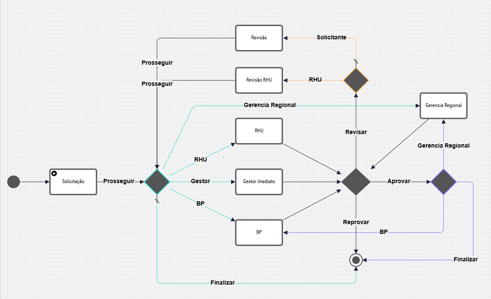

# 🚀 Carrefour -15 Desligamento

## ❕ Sobre

Projeto BPM da fábrica de software - Senior Sistemas
 
**Grupo:** hcm-services-tower.

## 🔌 Links

- [Jira](https://jira.senior.com.br/browse/FABPRH-2198)

## 💻 Tecnologias

- **Front-End:** Angular V11.2 e Typescript
- **Back-End:** LSP

## ✅ Get Started

- Utilizar a versão 14.20.1 do Node `nvm use 14.20.1`.
- Executar o comando `npm install` para instalar todas as dependências do projeto;
- Executar o comando `npm run start` para rodar o projeto.

## 📸 Fluxo

  

## 🌐 Web Services

- com.senior.automacao.hcm.desligamento:
  - **dadosSolicitante**: Retornar os dados do usuario da plataforma de forma expessifica para o fluxo.
  - **persisteSolicitacao**: Persiste solicitação de desligamento.
  - **retornaColaboradores**: Retornar os dados dos colaboradores abaixo do solicitante, ou todos da empresa.
  - **retornaMotivosDesligamento**: Retornar os motivos de empréstimo.
  - **retornaSla**: Retorna a o tempo de SLA para cada etapa do fluxo.

## 📅 Tabelas envolvidas

- USU_TSlaDes (Cadastro de parametros de SLA por etapa do fluxo de desligamento - BPM)
- USU_TCadBp (Tabela de cadastro de BP)

## 📡 Regra e Processo Automatico

**ADM de Pessoal**: 783 - BPM - Finaliza tarefas expiradas Desliga

## 💻 Telas SGI

**Parametrizacao SLA BPM Desligamento**
**Interface**: I_AP_SLA_Desligamento
**Formulário**: F_AP_SLA_Desligamento

## 📩 Importador

**ADM de Pessoal**: 12001 - BPM - Cadstro de BP

## 🎥 Repasse

[Link](https://seniorsistemassa-my.sharepoint.com/:v:/g/personal/marcelo_filho_senior_com_br/ERePYMqfEUhOqqpGv9Oe2xQB-CtbCmwjmswMM0QkNPs7Bw?nav=eyJyZWZlcnJhbEluZm8iOnsicmVmZXJyYWxBcHAiOiJTdHJlYW1XZWJBcHAiLCJyZWZlcnJhbFZpZXciOiJTaGFyZURpYWxvZy1MaW5rIiwicmVmZXJyYWxBcHBQbGF0Zm9ybSI6IldlYiIsInJlZmVycmFsTW9kZSI6InZpZXcifX0%3D&email=juan.nicoletti%40senior.com.br&e=To4itw)
